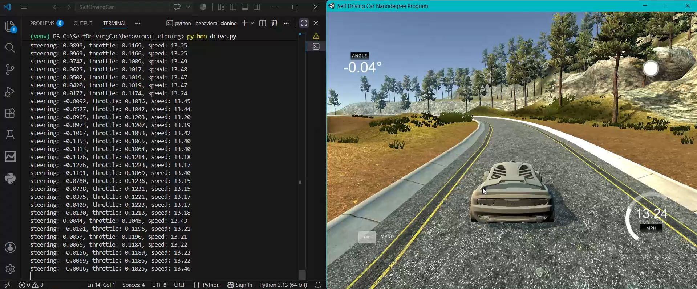

# Behavioral Cloning - Self Driving Car



Bu proje, Udacity'nin Self-Driving Car simülatöründe toplanan sürüş verisiyle
bir CNN (Convolutional Neural Network) eğitip, aracı otonom modda süren bir
behavioral cloning uygulamasıdır. Model, NVIDIA'nın self-driving car
makalesinde önerilen mimariyi temel alır.

## Nasıl çalışır?

1. Simülatörde manuel olarak sürülen bir sürüş kaydedilir (kamera görüntüleri + direksiyon açısı).
2. Bu veriyle bir CNN eğitilir: girdi olarak kamera görüntüsü, çıktı olarak direksiyon açısı tahmini.
3. Eğitilen model, simülatörün otonom modunda canlı olarak aracı yönlendirir.

## Dosyalar

- `model.py` — veri yükleme, ön işleme, veri artırma (augmentation) ve model eğitimi
- `drive.py` — eğitilen modeli simülatörle canlı bağlayıp aracı süren script
- `explore_data.py` — toplanan verinin (direksiyon açısı dağılımı) keşfi
- `model.h5` — eğitilmiş model ağırlıkları

## Kurulum

```bash
python -m venv venv
.\venv\Scripts\Activate   # Windows
pip install -r requirements.txt
```

## Kullanım

Veriyi toplamak için simülatörü Training Mode'da çalıştırıp kayıt yapın,
`data/` klasörüne kaydedin. Ardından:

```bash
python model.py
```

Model eğitildikten sonra, simülatörü Autonomous Mode'a alıp:

```bash
python drive.py
```

## Model Mimarisi

NVIDIA'nın "End to End Learning for Self-Driving Cars" makalesindeki mimariyi temel alır:
5 konvolüsyon katmanı + 4 tam bağlantılı (dense) katman, çıktı olarak tek bir
direksiyon açısı değeri üretir.

| Katman | Çıktı Boyutu | Parametre Sayısı |
|---|---|---|
| Lambda (normalizasyon) | (66, 200, 3) | 0 |
| Conv2D (24 filtre, 5x5) | (31, 98, 24) | 1,824 |
| Conv2D (36 filtre, 5x5) | (14, 47, 36) | 21,636 |
| Conv2D (48 filtre, 5x5) | (5, 22, 48) | 43,248 |
| Conv2D (64 filtre, 3x3) | (3, 20, 64) | 27,712 |
| Conv2D (64 filtre, 3x3) | (1, 18, 64) | 36,928 |
| Flatten | 1152 | 0 |
| Dropout (0.5) | 1152 | 0 |
| Dense | 100 | 115,300 |
| Dense | 50 | 5,050 |
| Dense | 10 | 510 |
| Dense (çıktı) | 1 | 11 |

**Toplam parametre: 252,219**

## Veri Artırma (Data Augmentation)

Ham veri, çoğunlukla "düz git" (direksiyon ≈ 0) örneklerinden oluşuyordu. Bunu dengelemek için:
- Sol/sağ kamera görüntüleri, direksiyon düzeltmesiyle (±0.2) kullanıldı
- Görüntüler %50 ihtimalle yatayda aynalanıp (flip) direksiyon işareti ters çevrildi

## Kullanılan Teknolojiler

- Python 3.10
- TensorFlow 2.10 (GPU destekli)
- OpenCV
- NumPy / Pandas / scikit-learn


[ENG]
# Behavioral Cloning - Self Driving Car

This project trains a CNN (Convolutional Neural Network) on driving data
collected from Udacity's Self-Driving Car simulator, then uses it to drive
the car autonomously. The model is based on the architecture proposed in
NVIDIA's self-driving car paper.

## How it works

1. A human drives manually in the simulator, and the drive is recorded
   (camera images + steering angle).
2. A CNN is trained on this data: input is a camera image, output is a
   predicted steering angle.
3. The trained model then drives the car in real time in the simulator's
   autonomous mode.

## Files

- `model.py` — data loading, preprocessing, data augmentation, and model training
- `drive.py` — connects the trained model to the simulator in real time to drive the car
- `explore_data.py` — exploration of the collected data (steering angle distribution)
- `model.h5` — trained model weights

## Setup

```bash
python -m venv venv
.\venv\Scripts\Activate   # Windows
pip install -r requirements.txt
```

## Usage

To collect data, run the simulator in Training Mode, record a drive, and
save it to the `data/` folder. Then run:

```bash
python model.py
```

Once the model is trained, switch the simulator to Autonomous Mode and run:

```bash
python drive.py
```

## Model Architecture

Based on the architecture from NVIDIA's "End to End Learning for Self-Driving
Cars" paper: 5 convolutional layers followed by 4 fully connected (dense)
layers, producing a single steering angle output.

| Layer | Output Shape | Parameters |
|---|---|---|
| Lambda (normalization) | (66, 200, 3) | 0 |
| Conv2D (24 filters, 5x5) | (31, 98, 24) | 1,824 |
| Conv2D (36 filters, 5x5) | (14, 47, 36) | 21,636 |
| Conv2D (48 filters, 5x5) | (5, 22, 48) | 43,248 |
| Conv2D (64 filters, 3x3) | (3, 20, 64) | 27,712 |
| Conv2D (64 filters, 3x3) | (1, 18, 64) | 36,928 |
| Flatten | 1152 | 0 |
| Dropout (0.5) | 1152 | 0 |
| Dense | 100 | 115,300 |
| Dense | 50 | 5,050 |
| Dense | 10 | 510 |
| Dense (output) | 1 | 11 |

**Total parameters: 252,219**

## Data Augmentation

The raw data was mostly made up of "drive straight" samples (steering ≈ 0).
To balance this out:
- Left/right camera images were used with a steering correction (±0.2)
- Images were randomly flipped horizontally (50% chance), with the
  steering angle sign inverted accordingly

## Technologies Used

- Python 3.10
- TensorFlow 2.10 (GPU-enabled)
- OpenCV
- NumPy / Pandas / scikit-learn